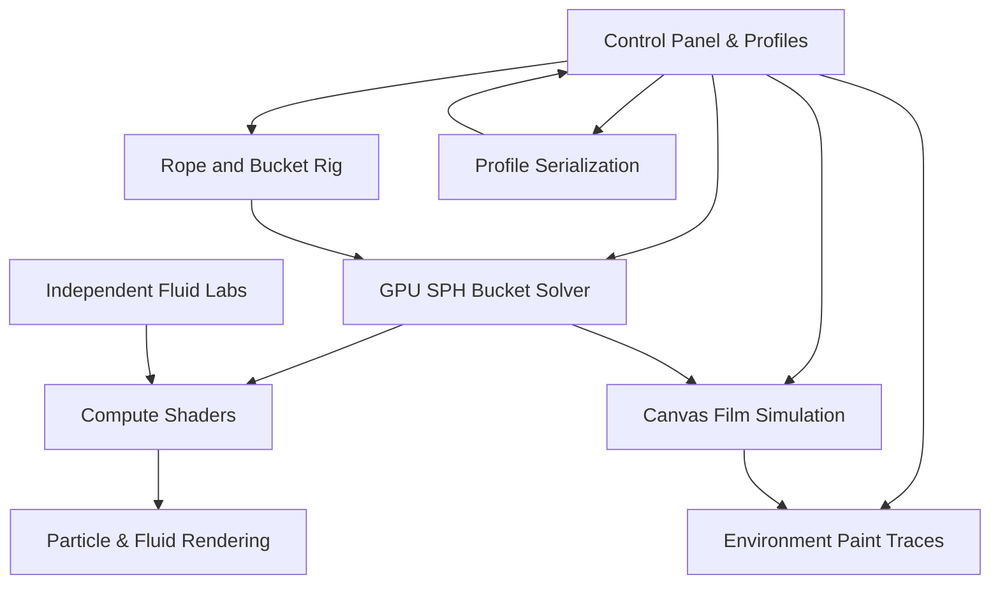
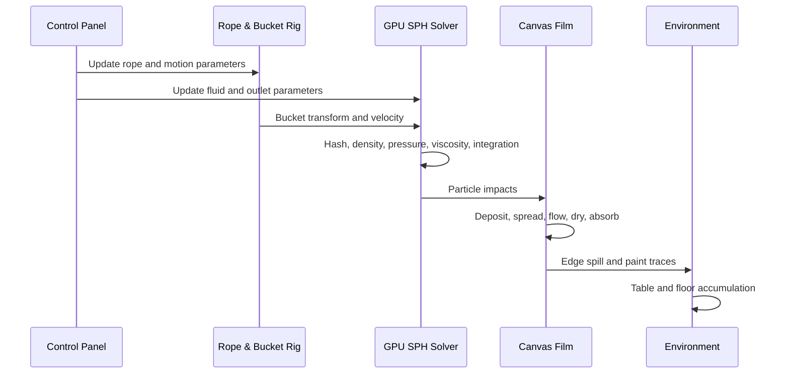

<div align="center">

# GPU SPH Painting Simulation Engine

### محرك أكاديمي متكامل لمحاكاة الطلاء والسوائل في الزمن الحقيقي داخل Unity

محاكاة جسيمية على الـGPU تجمع بين **Smoothed Particle Hydrodynamics (SPH)**، وديناميكيات الحبل والدلو، وترسيب الطلاء على أسطح متعددة، والجريان والجفاف والامتصاص، وبيئة رسم تفاعلية قابلة للضبط والحفظ.


</div>

---

## Table of Contents

- [1. مقدمة عامة](#1-مقدمة-عامة)
- [2. معمارية المشروع وهيكليته](#2-معمارية-المشروع-وهيكليته)
- [3. الميزات والخصائص](#3-الميزات-والخصائص)
- [4. التقنيات المستخدمة](#4-التقنيات-المستخدمة)
- [5. التحديات التقنية أثناء التطوير](#5-التحديات-التقنية-أثناء-التطوير)
- [6. التثبيت والتشغيل](#6-التثبيت-والتشغيل)
- [7. الاختبارات والتحقق](#7-الاختبارات-والتحقق)
- [8. الأداء والتحسينات المستقبلية](#8-الأداء-والتحسينات-المستقبلية)
- [9. الجانب الأكاديمي](#9-الجانب-الأكاديمي)
- [10. الخاتمة](#10-الخاتمة)
- [هيكل المجلدات](#هيكل-المجلدات)
- [المشاهد المتاحة](#المشاهد-المتاحة)
- [اختصارات التحكم](#اختصارات-التحكم)
- [ملاحظات مهمة](#ملاحظات-مهمة)

---

# 1. مقدمة عامة

## نظرة عامة

**GPU SPH Painting Simulation Engine** هو مشروع أكاديمي لبناء منظومة تفاعلية تحاكي الطلاء منذ وجوده داخل دلو متحرك ومعلّق بحبل، مرورًا بخروجه من فتحة الدلو وسقوطه في الهواء، ثم اصطدامه بسطح الرسم وانتشاره وانزلاقه واختلاطه وجفافه وامتصاصه.

لا يكتفي المشروع بإظهار جسيمات تسقط بصريًا، بل يحاول تمثيل سلسلة مترابطة من الظواهر:

1. ديناميكيات السائل داخل الوعاء.
2. خروج السائل من فتحة سفلية أو عدة مخارج.
3. تفاعل السائل مع حركة الدلو الخطية والدورانية.
4. ديناميكيات الحبل والنواس والحامل.
5. اصطدام جسيمات الطلاء بسطح الرسم.
6. تحويل الجسيمات إلى طبقة طلاء قابلة للجريان.
7. تأثير اللزوجة والتوتر السطحي والالتصاق والاحتكاك.
8. الامتصاص والجفاف وإعادة الترطيب.
9. خلط الألوان والطلاءات المختلفة.
10. جريان الطلاء من حواف اللوحة إلى الطاولة والأرض.

## المشكلة التي يحلها المشروع

محاكاة الطلاء في الزمن الحقيقي أصعب من محاكاة الماء البسيط، لأن الطلاء قد يكون شديد اللزوجة أو شبه مائي، وقد يتصرف ككتلة ثقيلة أو كفيلم رقيق، ويتأثر بنوع السطح وميله ودرجة رطوبته. كما أن تنفيذ هذه الظواهر باستخدام أعداد كبيرة من الجسيمات على المعالج المركزي يؤدي بسرعة إلى انخفاض الأداء.

لذلك يعتمد المشروع على **Compute Shaders** وتنفيذ متوازٍ على بطاقة الرسوميات، مع نموذج هجين يجمع بين الجسيمات ثلاثية الأبعاد في الدلو والهواء، وفيلم ثنائي الأبعاد فوق سطح الرسم.

## الهدف الأكاديمي

تم اختيار المشروع من أجل:

- تطبيق مفاهيم الفيزياء العددية بدل استخدام مؤثر سائل جاهز فقط.
- دراسة وتنفيذ **SPH — Smoothed Particle Hydrodynamics**.
- بناء Neighbor Search مناسب للـGPU.
- دمج أكثر من نظام فيزيائي داخل تجربة واحدة.
- دراسة الفرق بين محاكاة الحجم السائل ومحاكاة الفيلم الرقيق.
- إنشاء واجهة تسمح بالتجريب العلمي وتغيير القيم لحظيًا.
- بناء مختبرات مستقلة لمقارنة SPH وPBF وحلول الأعداد العالية.

## القيمة التي يقدمها المشروع

- منصة تعليمية لفهم SPH وPBF والمحاكاة المتوازية.
- بيئة تجريبية لدراسة أثر اللزوجة والضغط والتوتر السطحي.
- أداة تفاعلية لمقارنة أنواع الطلاء والأسطح.
- أساس قابل للتوسعة نحو VR والفنون الرقمية والتدريب.
- مجموعة مشاهد بحثية تتدرج من Solver مباشر إلى محاكاة مليونية.

---

# 2. معمارية المشروع وهيكليته

## النمط المعماري

المشروع لا يستخدم MVC تقليديًا؛ بل يعتمد **Modular Component Architecture** مع فصل واضح بين الفيزياء والعرض والأسطح والبيئة والواجهة والحفظ. هذا الفصل يسمح بتطوير Solver أوShader أوواجهة دون إعادة بناء المنظومة كاملة.



## الطبقات الأساسية

### طبقة الدلو والسائل

المكوّن الرئيسي هو:

```text
SPHGPUFrustumBucketSolver
```

وهو مسؤول عن إنشاء الجسيمات، إدارة حالاتها داخل الدلو وخارجه، بناء الشبكة المكانية، حساب الكثافة والضغط واللزوجة والتوتر السطحي، التصادم مع الوعاء، إدارة المخارج، وإرسال اصطدامات الطلاء إلى اللوحة.

الحسابات الأساسية منفذة داخل:

```text
Assets/Resources/SPH/SPHFluidFrustumGPU.compute
```

### طبقة الحبل والحامل

```text
SPHMassSpringBucketRig
```

تستخدم نموذج Mass–Spring لتمثيل طول الحبل ومرونته وتخميده والتوائه وحركة النواس والحزام الثلاثي والتحكم اليدوي بالدلو.

### طبقة سطح الرسم

```text
SPHGPUCanvasSurface
SPHCanvasPaint.compute
```

تحوّل اصطدامات الجسيمات إلى فيلم ثنائي الأبعاد على الـGPU يحتوي على اللون والسماكة والرطوبة والامتصاص واللزوجة والتماسك والجفاف والجريان على الميل والانسكاب من الحواف.

### طبقة البيئة

```text
SPHEnvironmentPaintTraces
```

تستقبل الطلاء على السطح الأبيض والأرض، وتعرض آثار البيئة وشلالات الحواف وانسكاب الطلاء من لوحة الرسم.

### طبقة العرض

تستخدم المنظومة عدة Shaders، من أهمها:

```text
SPHParticleIndirect.shader
SPHSmoothFluidSurface.shader
SPHCanvasDisplay.shader
SPHEnvironmentPaintTrace.shader
SPHEdgeWaterfall.shader
SPHBucketMultiOutletURP.shader
```

### طبقة الواجهة والتحكم

```text
SPHControlPanel
```

تتحكم في إعدادات السائل والتدفق والسطح والدلو والحبل والرندر والبيئة والكاميرا والبروفايلات والإحصاءات.

### طبقة البروفايلات

```text
SPHSimulationProfiles.cs
SPHControlPanel.cs
```

توفّر مكتبة تصل إلى 20 خانة، مع حفظ الإعدادات فقط أوحفظ Full State، ووصفات مستقلة لكل نوع طلاء وسطح. يتم التخزين بصيغة JSON في:

```text
Application.persistentDataPath/PaintSimulationProfiles.json
```

## دورة البيانات



---

# 3. الميزات والخصائص

## محاكاة SPH على الـGPU

تنفذ مراحل بناء الشبكة، إيجاد الجيران، الكثافة، الضغط، اللزوجة، XSPH، التوتر السطحي، التكامل والتصادم على GPU، ما يرفع القدرة على التعامل مع أعداد جسيمات أكبر من تنفيذ CPU تقليدي.

## أنواع متعددة من الطلاء

يدعم النظام Presets مثل:

- Extra Watery
- Watery
- Flowing
- Normal
- Thick
- Hybrid
- Line Painting

كل نوع يضبط مجموعة مترابطة من الخصائص الفيزيائية والبصرية.

## أسطح متعددة

يدعم Canvas وPaper وWood وMetal، مع اختلاف الالتصاق والخشونة والاحتكاك والامتصاص والجفاف والانزلاق.

## محاكاة فيلم الطلاء

بعد الاصطدام تتحول الكتلة إلى Surface Film يحاكي:

- البرك والانزلاق.
- الآثار المتروكة خلف السيل.
- السماكة والرطوبة.
- الامتصاص والجفاف.
- إعادة الترطيب.
- خلط الألوان.
- الانسكاب من الحواف.

## نظام الحبل والدلو

- حبل مرن مع تخميد والتواء.
- طول قابل للتعديل لحظيًا.
- حزام تعليق ثلاثي.
- نواس ودوران وإطلاق مداري.
- تحكم يدوي بالدلو.
- Pause مستقل.
- تصادم الدلو مع سطح الرسم.

## مخارج متعددة

- فتحة سفلية.
- Top Spill.
- Multi-Outlet definitions.
- محرر Runtime للمخارج.
- فتح وإغلاق وتعديل موضع وحجم المخرج.

## Continuous Nozzle وControlled Stream Emitter

يوفران تنظيم السيل قرب الفتحة عبر التحكم بالطول والقوة والسرعة والتخميد الجانبي وتأثير حركة الدلو.

## خلط الألوان

يدعم ألوانًا جاهزة ومخصصة، وخلطًا على اللوحة وداخل الدلو بصورة اختيارية، مع الاحتفاظ بلون الجسيم بعد خروجه.

## الجفاف والامتصاص وإعادة الترطيب

يتضمن النموذج إعدادات لـDrying Rate وAbsorption وDry Film Lock وWet-on-Dry Mixing وOld Film Resistance وOvercoat Retention.

> النموذج تعليمي وفني، وليس نموذجًا كيميائيًا صناعيًا كاملًا لكل أنواع الدهانات.

## الانسكاب البيئي

- خروج الطلاء من حافة اللوحة.
- شلال بصري إلى السطح السفلي.
- آثار على السطح الأبيض.
- وصول الطلاء إلى الأرض.
- إمكانية مسح آثار البيئة.

## استيراد صورة كطلاء

يدعم Exact وArtistic وDripping، مع التحكم بعدد الطبقات والسماكة والرطوبة وكثافة الخطوط والقطرات والبذرة العشوائية.

## البروفايلات والحفظ

- 20 خانة.
- Settings Save وFull State Save.
- وصفات مستقلة لكل نوع طلاء وسطح.
- بروفايلات جاهزة.
- Versioned JSON migration.

## الكاميرا

Perspective وFront وSide وTop وFree Camera، مع حركة سينمائية وتسارع وتباطؤ ناعمين.

## التشخيص

- FPS وإحصاءات Runtime.
- الكثافة والضغط والجيران والسرعة والتسارع.
- Memory profiling tool.
- Missing Script Cleaner.
- أدوات Editor لإنشاء وفتح المشاهد.

## مختبرات مستقلة

- Direct Cohesive SPH.
- High-Count GPU particles.
- Hybrid Million Particle Lab.
- Legacy Fluid Lab.
- Million PBF Stable Lab.

## الذكاء الاصطناعي والأتمتة

لا يستخدم المشروع Machine Learning أوخدمات AI في المحاكاة. الأتمتة الموجودة تقليدية وتشمل إنشاء الموارد وتطبيق البروفايلات وترحيل الحفظ وإدارة Buffers وMeshes وMaterials.

---

# 4. التقنيات المستخدمة

| التقنية | الدور | سبب الاختيار |
|---|---|---|
| Unity 2022.3.62f3 LTS | المحرك الرئيسي | الاستقرار ودعم Compute Shaders |
| C# | Runtime وEditor tooling | التكامل الأصلي مع Unity |
| HLSL Compute Shaders | الفيزياء المتوازية | تنفيذ كثيف على GPU |
| URP 14.0.12 | الرندر | توازن الجودة والأداء |
| Indirect GPU Rendering | رسم الجسيمات | تقليل نقل البيانات CPU/GPU |
| SPH | محاكاة السائل | مناسب للسوائل الحرة الجسيمية |
| PBF | مختبرات عالية الاستقرار | تحسين الاستقرار في بعض السيناريوهات |
| Mass–Spring | الحبل | نموذج مباشر ومرن |
| RenderTexture / ComputeBuffer | تخزين الفيلم والجسيمات | إبقاء البيانات على GPU |
| JSON Serialization | البروفايلات | قابلية النقل والإصدار |
| Unity IMGUI | الواجهة البحثية | سرعة التطوير وكثرة أدوات الضبط |
| Unity Recorder | التسجيل | توثيق التجارب |
| Git / GitHub | إدارة المصدر | التتبع والتعاون والنشر |

## Backend / Frontend / Database

هذا تطبيق Unity Standalone وليس تطبيق Web:

- **Backend:** لا توجد خدمة منفصلة؛ المنطق داخل Unity.
- **Frontend:** واجهة Runtime داخل Unity.
- **Database:** لا توجد قاعدة بيانات؛ الحفظ محلي بصيغة JSON.
- **Environment Variables:** غير مطلوبة.
- **AI Service:** غير مستخدمة.
- **Deployment:** Unity Standalone Build.

---

# 5. التحديات التقنية أثناء التطوير

## رفع عدد الجسيمات

تم نقل الحسابات إلى GPU، واستخدام Spatial Grid، وبناء مشاهد High-Count ومشاهد مليونية منفصلة لتجنب تحميل المشهد الرئيسي كل تعقيد التجارب البحثية.

## استقرار السائل داخل الدلو

ظهرت مشكلات مثل التطاير والانضغاط والاهتزاز. تمت معالجتها بمعايرة Rest Density وPressure Stiffness، وإضافة XSPH، ووضع حدود للسرعة والتسارع، وتحسين تصادم الوعاء، وبناء مختبر PBF مستقل.

## السيل الخارج من الفتحة

ظهرت مشكلات التقطيع والكتل المنفصلة وتأثر السيل بحركة الدلو. تم تطوير Continuous Nozzle وControlled Stream Emitter ورندر سيل مستقل، مع الاحتفاظ بالمسار الأكثر استقرارًا في النسخة النهائية.

## تحويل الجسيمات إلى فيلم

إبقاء كل الجسيمات حيّة فوق اللوحة كان مكلفًا وغير مناسب للجفاف والامتصاص، لذلك تم اعتماد معمارية هجينة:

```text
3D SPH particles in bucket and air
               ↓
2D GPU film on the painting surface
```

## اختلاف الأسطح

تم اعتماد وصفات مستقلة لكل زوج من Paint Type وSurface Type بدل استخدام قيم عامة لا تناسب جميع الخامات.

## حفظ البروفايلات دون تلوث القيم

تم فصل Settings Save عن Full State، وإضافة إصدار لمخطط JSON، وفصل القيم المكانية عن وصفات الطلاء، وإضافة ترحيل تلقائي للمكتبة.

## التعرق والشرائط غير الطبيعية

تمت إضافة Bridge modes والتحكم بعدد الوصلات وعمرها وعرضها، وجعل Flow Variation اختيارية، وإنشاء بروفايلات مستقرة ومحافظة.

## الأداء مقابل الشكل

تم استخدام Indirect Rendering وVisual Copies اختيارية وSmooth Fluid Renderer اختياري، مع إعدادات URP Performant وBalanced وHigh Fidelity.

## أخطاء Compute Shader

تم التعامل مع أخطاء Kernels وBuffers عبر توحيد الأسماء والربط الصريح وإضافة Fallbacks وتعطيل الميزات غير المتاحة بدل تعطيل المشهد كاملًا.

---

# 6. التثبيت والتشغيل

## المتطلبات

- Unity Hub.
- Unity Editor **2022.3.62f3**.
- Visual Studio 2022 أوJetBrains Rider.
- GPU يدعم Compute Shaders وDirectX 11.
- Windows 10/11 64-bit هو المسار الأساسي المختبر.
- 16 GB RAM أوأكثر مفضلة للتطوير.

## الاستنساخ

```bash
git clone https://github.com/<your-username>/<repository-name>.git
cd <repository-name>
```

## فتح المشروع

1. افتح Unity Hub.
2. اختر **Add project from disk**.
3. حدد المجلد الذي يحتوي `Assets` و`Packages` و`ProjectSettings`.
4. افتحه باستخدام Unity `2022.3.62f3`.
5. انتظر اكتمال Import وShader Compilation.

## المشهد الرئيسي

```text
Assets/Scenes/PaintingSystem/SPH_GPU_IntegratedRig_LinePainting.unity
```

ثم اضغط Play.

## البناء

من Unity:

```text
File → Build Settings / Build Profiles
```

اختر Windows, Mac, Linux Standalone، ثم x86_64، وتأكد من وجود المشهد الرئيسي في Build Settings.

## المشاهد المسجلة في Build Settings

```text
Assets/Scenes/PaintingSystem/SPH_GPU_IntegratedRig_LinePainting.unity
Assets/Scenes/FluidLabs/SPH_GPU_HybridMillionFluidLab.unity
Assets/Scenes/FluidLabs/SPH_GPU_DirectStableFluidLab.unity
Assets/Scenes/FluidLabs/SPH_GPU_HighCountFluidLab.unity
Assets/Scenes/FluidLabs/MillionPBFStableLab/SPH_GPU_MillionPBFStableLab.unity
```

## Environment Variables

لا يحتاج المشروع إلى `.env` أوEnvironment Variables.

## ملفات Runtime المحلية

```text
Application.persistentDataPath/PaintSimulationProfiles.json
```

على Windows يكون المسار عادة داخل:

```text
C:\Users\<User>\AppData\LocalLow\<CompanyName>\<ProductName>\
```

## التشغيل من سطر الأوامر

```powershell
"C:\Program Files\Unity\Hub\Editor\2022.3.62f3\Editor\Unity.exe" `
  -projectPath "C:\Path\To\Painting-Simulation-Engine"
```

لا يوجد Build Script آلي موحد مضمّن حاليًا؛ البناء الاعتيادي يتم من واجهة Unity.

---

# 7. الاختبارات والتحقق

## الحالة الحالية

يعتمد المشروع أساسًا على اختبارات Runtime يدوية، ومشاهد مختبرية مستقلة، وإحصاءات داخلية، ومقارنة بصرية، واختبارات أداء على أعداد مختلفة من الجسيمات. لا توجد حاليًا حزمة شاملة من Unit Tests أوIntegration Tests باستخدام Unity Test Framework.

## ما الذي يتم اختباره؟

### السائل

- استقرار الكثافة والضغط.
- الجسيمات قرب الجدران.
- خروج الطلاء من الفتحة.
- التوتر السطحي والتماسك.
- مستويات أعداد الجسيمات.

### السطح

- الاصطدام وعدم اختراق اللوحة.
- الانتشار والانزلاق.
- اختلاف الخامات.
- الجفاف والامتصاص.
- خلط الألوان.
- الانسكاب من الحواف.

### المنظومة

- الحبل وPause/Resume.
- إعادة تعبئة الدلو.
- تبديل البروفايلات.
- الحفظ والاستعادة.
- الكاميرا.
- Standalone Build على DX11.

## إحصاءات Runtime

اضغط `F1` لعرض FPS ومتوسط الكثافة والضغط والجيران والسرعة والتسارع ونسبة جسيمات السطح.

## اختبارات مستقبلية مقترحة

- EditMode tests للـProfile Serialization.
- PlayMode tests لتبديل البروفايلات.
- GPU readback tests لحفظ الكتلة.
- Regression tests للكثافة والضغط.
- Snapshot tests للفيلم.
- Tests لربط Kernels وBuffers.

---

# 8. الأداء والتحسينات المستقبلية

## نقاط القوة الحالية

- تنفيذ الحسابات المكلفة على GPU.
- استخدام ComputeBuffers وIndirect Rendering.
- فصل فيلم السطح عن الجسيمات.
- مستويات جودة متعددة.
- عدم إنشاء GameObject لكل جسيم.
- مختبرات مستقلة للأعداد الكبيرة.

## عوامل تؤثر في الأداء

- عدد الجسيمات وSubsteps.
- Smoothing Radius وكثافة الجيران.
- Film Resolution.
- Visual Copies.
- Smooth Fluid Rendering.
- عدد المخارج.
- الظلال وجودة URP.
- عمليات GPU Readback التشخيصية.

## تحسينات مستقبلية

### الفيزياء

- Adaptive Time Stepping.
- Particle splitting/merging.
- Affine أوCorotational viscosity.
- Anisotropic kernels.
- نموذج Dry Base + Active Wet Film.
- Rewet يعتمد على نوع المادة الكيميائي.
- اختبارات حفظ الكتلة والطاقة.

### الرندر

- Screen-space fluid surface.
- GPU marching cubes.
- Temporal smoothing.
- Motion vectors.
- Refraction وthickness absorption أفضل.
- LOD للجسيمات البعيدة.

### الأسطح

- طبقة جافة منفصلة عن الفيلم الرطب.
- Wet-over-dry وThick-over-dry أكثر واقعية.
- خصائص سطحية مبنية على Textures.
- Floor Puddle Film متقدم.
- حفظ الرسمة بصيغة GPU-friendly.

### الأدوات

- Unity Test Framework.
- Benchmark scene آلي.
- CSV performance exporter.
- Profile comparison tool.
- رسوم للكثافة والضغط.
- GitHub Actions للبناء.

### VR

- VR Controllers.
- إمساك الدلو وتحريكه.
- World-Space UI.
- Haptic feedback.

---

# 9. الجانب الأكاديمي

هذا المشروع **أكاديمي بالكامل** وتم تطويره لدراسة المحاكاة العددية والرسوميات الفورية والتفاعل الفيزيائي داخل Unity.

## النتيجة الأكاديمية

حقق المشروع **العلامة الكاملة** في التقييم الأكاديمي.

## أسباب تميزه

- Solver جسيمي مخصص بدل الاعتماد على Asset جاهز فقط.
- GPU Compute Shaders.
- دمج SPH والحبل والسطح والرندر والواجهة.
- مختبرات مقارنة مستقلة.
- دعم أعداد جسيمات متعددة ومشاهد مليونية.
- واجهة تجريبية واسعة وقابلة للحفظ.
- معاملة الطلاء كمادة تختلف عن الماء.
- ربط البحث النظري بنتيجة تفاعلية قابلة للعرض.
- إعادة هيكلة وتحسينات متكررة بدل الاكتفاء بنموذج أولي.

## القيمة التعليمية

يصلح المشروع لدراسة Fluid Simulation وGPU Computing وNumerical Stability وSpatial Hashing وRendering Pipelines وSerialization وPerformance Profiling وتصميم الأنظمة الهجينة.

---

# 10. الخاتمة

يمثل **GPU SPH Painting Simulation Engine** نواة بحثية وعملية لمحاكاة الطلاء في الزمن الحقيقي، من حركة السائل داخل الدلو إلى ترسيبه وجريانه وجفافه فوق الأسطح.

قيمة المشروع لا تكمن في النتيجة البصرية فقط، بل في المعمارية التي تجمع Solver جسيميًا على GPU، ونظام حبل ودلو، وSurface Film Simulation، وبروفايلات مواد وأسـطح، وبيئة انسكاب، وأدوات حفظ وتشخيص.

يمكن تطويره مستقبلًا ليصبح تجربة VR تعليمية، أوأداة فن رقمي، أومختبر سوائل لزجة، أونواة لتطبيقات تدريب وألعاب وVisualization أكبر.

---

# هيكل المجلدات

```text
Painting-Simulation-Engine/
├── Assets/
│   ├── PaintSystem/
│   ├── Resources/SPH/
│   │   ├── *.compute
│   │   ├── *.shader
│   │   └── Embedded profile JSON files
│   ├── Scenes/
│   │   ├── PaintingSystem/
│   │   └── FluidLabs/
│   ├── Scripts/
│   │   ├── Editor/
│   │   └── Runtime/
│   │       ├── PaintingSystem/
│   │       │   ├── Bucket/
│   │       │   ├── Camera/
│   │       │   ├── Canvas/
│   │       │   ├── Environment/
│   │       │   ├── RopeAndRig/
│   │       │   └── UI/
│   │       ├── FluidLabs/
│   │       └── Shared/
│   └── Settings/
├── Packages/
├── ProjectSettings/
├── .gitignore
└── README.md
```

---

# المشاهد المتاحة

| المشهد | الغرض |
|---|---|
| `SPH_GPU_IntegratedRig_LinePainting` | التجربة الرئيسية للدلو والحبل والطلاء والأسطح |
| `SPH_GPU_DirectStableFluidLab` | اختبار SPH مباشر ومستقر |
| `SPH_GPU_HighCountFluidLab` | اختبار أعداد جسيمات مرتفعة |
| `SPH_GPU_HybridMillionFluidLab` | نظام هجين للمليون جسيم |
| `SPH_GPU_MillionPBFStableLab` | مختبر PBF عالي العدد |
| Legacy Fluid Lab | مقارنة مع النظام الأقدم |

---

# اختصارات التحكم

> قد تتغير بعض الاختصارات إذا تم تعديل القيم Serialized داخل Inspector.

| الاختصار | الوظيفة |
|---|---|
| `U` | إظهار/إخفاء لوحة التحكم |
| `H` | إظهار/إخفاء المساعدة |
| `F1` | إظهار إحصاءات SPH |
| `Enter` | تطبيق إعدادات التبويب |
| `P` | إيقاف/استئناف الحبل |
| `R` | التحكم اليدوي بالدلو |
| `Ctrl + R` | إعادة تشغيل السائل |
| `W A S D` | حركة الكاميرا أوالدلو حسب الوضع |
| الأسهم | إمالة الدلو في الوضع اليدوي |
| `Space` | موجة داخل السائل |
| `Shift + Space` | موجة قوية |
| `B` | فتح/إغلاق المخرج السفلي |
| `T` | Top Spill |
| `V` | التنقل بين زوايا الكاميرا |
| `F` | تغيير وضع الكاميرا |
| `F2` | Perspective |
| `F3` | Front |
| `F4` | Side |
| `F5` | Top |
| `1..8` | تغيير مستوى/عدد الجسيمات بحسب المشهد |
| `9` | نافذة الإعدادات الثانوية |
| `J` | Kick للحبل |
| `L` | Launch preset |
| `K` | Launch without spin |
| `I` | Spin only |

---

# ملاحظات مهمة

## الدقة العلمية

المشروع نموذج عددي تفاعلي لأغراض أكاديمية وفنية. بعض القيم تمت معايرتها لتحقيق توازن بين الواقعية والاستقرار والأداء، لذلك لا ينبغي استخدامه بدل برامج CFD الصناعية المعتمدة.

## تعديل Compute Shaders

أي تغيير في Kernels أوStructuredBuffers يجب أن يترافق مع تحديث الربط في C#، وإلا قد تظهر أخطاء مثل:

```text
Kernel at index is invalid
Property (...) at kernel index (...) is not set
```

## ملفات Unity التي لا ترفع إلى Git

```text
Library/
Temp/
Obj/
Logs/
Build/
Builds/
UserSettings/
.vs/
```

## الترخيص

لم يتم تحديد ترخيص مفتوح المصدر افتراضيًا. أضف ملف `LICENSE` قبل السماح بإعادة الاستخدام العام.

## المساهمة

قبل Pull Request:

1. افتح المشروع بإصدار Unity الصحيح.
2. اختبر المشهد الرئيسي.
3. تأكد من خلو Console من الأخطاء.
4. اختبر Build على DX11.
5. وثّق أي تغيير في Compute Shader.
6. لا تغيّر البروفايلات الجاهزة دون توضيح.

---

<div align="center">

**Academic GPU Fluid Simulation — Built with Unity, C#, HLSL, SPH and extensive iterative testing**

</div>
